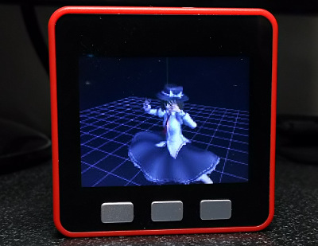
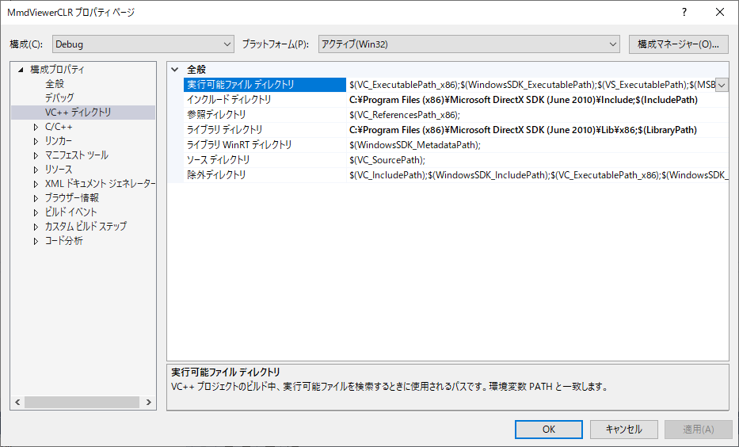

# M5Stack_MMD_WiFi_Version
 
In this version, M5Stack detects own attitude by IMU sensor and sends PC the attitude data.
PC executes 3D rendering calculation based on the attitude and sends M5Stack the image, and M5Stack displays it.
## How to uses
1. Write M5Stack_MMD_WiFi_Version.ino to M5Stack.
2. Build and execute MmdViewerSolution.sln by VisualStudio 2017.
3. Open PMD file for Model and VMD file for Motion. You can enable physics by checking in option menu.
4. Input IP to a Textbox in MMD Viewer Form and click Start button.
5. You can rotate the 3D model by moving M5Stack body like AR. This is realized by 6-axis sensor mounted in M5Stack FIRE or M5Stack GRAY.
## PMD data and VMD data
https://www6.atwiki.jp/vpvpwiki/
## movie 
https://twitter.com/Tw_Mhage/status/1132506761087180800 
https://twitter.com/Tw_Mhage/status/1134694811074682880
## PC requirement 
- Install DirectX SDK (June 2010)  
https://www.microsoft.com/en-us/download/details.aspx?id=6812
- Link project to the folder of DirectX SDK like below 

- If you use Visual Studio other than Visual Studio 2017, you have to build bullet library with bullet-2.82-r2704 and put lib files into VisualStudio2017/BulletLib.
## Notice
- Support only PMD. Not support PMX. You can convert PMX to PMD by PMXEditor (http://kkhk22.seesaa.net/category/14045227-1.html)